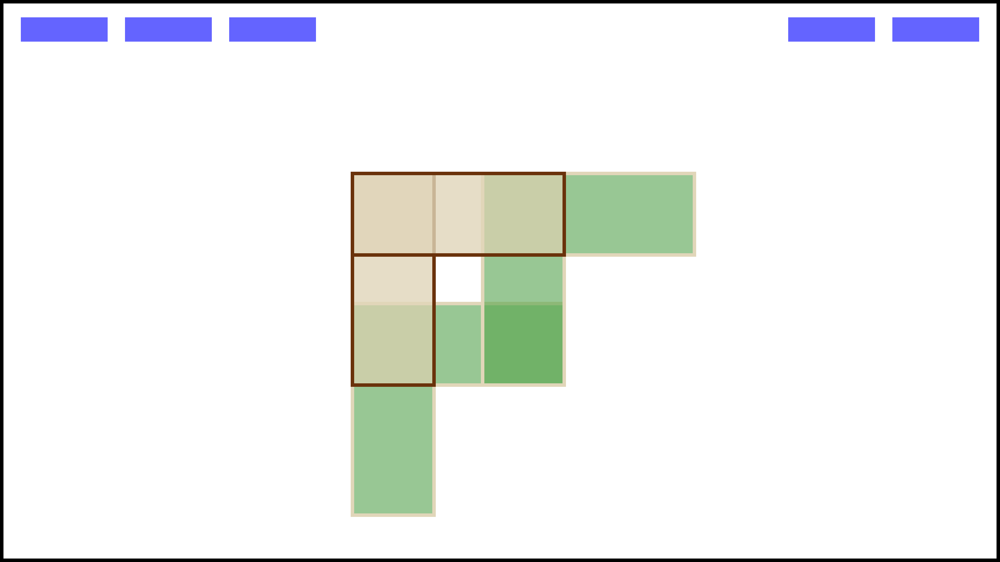
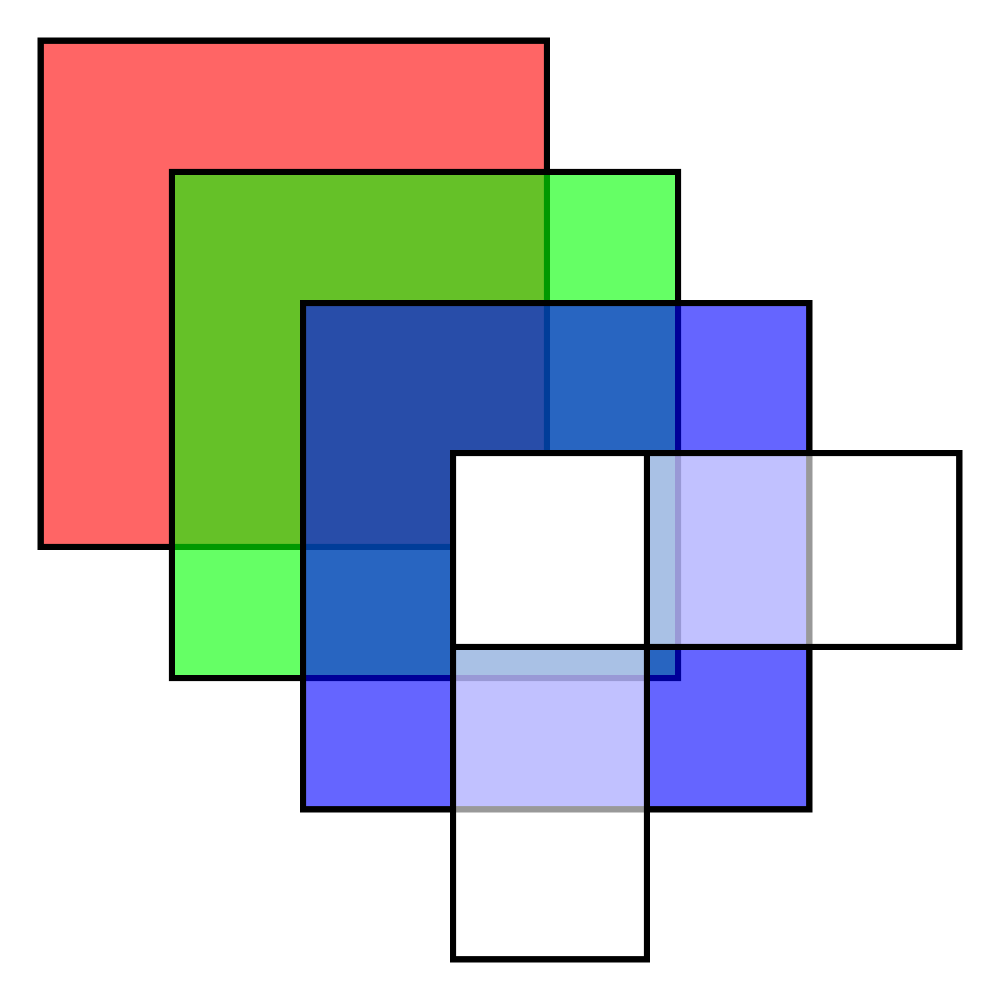

<h3 name="sherpa-header" id="sherpa-header" align="center">
  <br />
	
  <span width="400" />
	
	
  <h5 align="center"><sub><code>sherpa_41</code>-rendered webpages</sub></h5>
</h3>

# `sherpa_41` :mountain:

[](https://travis-ci.com/ayazhafiz/sherpa_41)
[](https://coveralls.io/github/ayazhafiz/sherpa_41?branch=master)

`sherpa_41` is a toy browser engine, based somewhat on [Limpet's _Let's build a browser engine!_](https://limpet.net/mbrubeck/2014/08/08/toy-layout-engine-1.html)
with architectures introduced in [CS3251](https://vuse-cs3251.github.io).

This app is meant to be explorative in nature, with particular [design philosophies](#a-brief-overview-of-sherpa_41s-design) that make use of modern `C++` and established design patterns to create an engine that is easy to understand and extend. Note, however, that the engine is ___not___ designed to be especially robust, or even useful.

### Usage

```bash
USAGE: sherpa_41 [options]

OPTIONS:
        --html                  HTML file to parse (=assets/rainbowBox.html)
        --css                   CSS file to parse (=assets/rainboxBox.css)
        -w, --width             Browser width (=800)
        -h, --height            Browser height (=600)
        -o, --out               Output file (=output.png)
        --help                  Show this help screen
```

Almost any file type designed to show images can be used as the output file. `.png`, `.pdf`, `.jpg` are all great options, and you can even output to a `.html` file if you want.

An example of a custom invocation:

```bash
sherpa_41 --html index.html --css style.css -w 1800 -h 1200 -o myIndex.jpg
```

### Building

First, you will need [CMake](https://cmake.org) and [Magick++](https://imagemagick.org/Magick++/).
Both come pre-installed with most Linux distros, and are easy to install on MacOS and Windows.

Clone the repo and its dependencies, then make the project:

```bash
git clone --recursive https://github.com/ayazhafiz/sherpa_41.git
cd sherpa_41 && cmake .
make
./sherpa_41-test && ./sherpa_41
```

For hacking on sherpa, please see the [development notes](#development-notes) below.

### Features

- The HTML parser currently supports elements, comments, and text nodes.

- The CSS parser currently supports tag, class, id, and wildcard selectors, and has support for text, color (RGB/A, #HEX), and numerical unit declarations.

- The Display module can currently issue commands to render rectangular block nodes.

- Sherpa's `Canvas` renderer can currently generate basic webpages like [the header](#sherpa-header).

### Notes

- There is no GUI renderer (yet?!). Until one is made, the front-end is really just an image. But a cool, nicely-rendered image, because sherpa has awesome renderers.

- JavaScript is turned off by default, and can't be turned on. You may say JavaScript is unsupported. I say you're right.

- Please try to break the application, and submit an [issue](https://github.com/ayazhafiz/sherpa_41/issues/new) or [pull request](https://github.com/ayazhafiz/sherpa_41/compare) when you do. I promise you can break it. Pretty easily. Okay, maybe very easily.

- There is no networking (yet!). I.e. so far, you can only show websites for which you have the HTML/CSS source.

### Development Notes

##### Adding features

When adding a new feature or module to `sherpa_41`, please also add appropriate [GTests](https://github.com/google/googletest) for it in `tests/`. Generally, the structure of the `tests/` directory should mirror that of `src/`.

Before submitting a [PR](https://github.com/ayazhafiz/sherpa_41/compare), please take care that your changes pass on [Travis](https://travis-ci.com/ayazhafiz/sherpa_41) and have at least [80% coverage](https://coveralls.io/repos/github/ayazhafiz/sherpa_41).

The `sherpa_41` repository includes a pre-commit hook to insure the codebase is formatted according to the `.clang-format` spec provided. To format the code, use `clang-format -i include/**/*.hpp src/**/*.cpp tests/**/*.{hpp,cpp}`.

##### A Brief Overview of `sherpa_41`'s Design

In order of importance, Sherpa's main design goals are _sound architecture_, _memory and type safety_, and _efficiency_.

1. __Sound architecture__ - because `sherpa_41` is meant to be easy to explore and extend, reusable components and solid design patterns are valued overwhelmingly above succinctness or efficiency (done properly, these will usually lend toward each other anyway). Additionally, sherpa strives to adhere to modern, idiomatic C++, and effort should be taken to use this standard as much as possible.

2. __Memory and type safety__ - `sherpa_41`'s memory philosophy is Rust's in a C++ wrapper. This means RAII, dynamic allocation with `unique_ptr`s, and move semantics are taken large advantage of. Here may be where C++ idioms stray the most, with sherpa using static methods like `::from` to return unique pointers to polymorphic objects.

3. __Efficiency__ - `sherpa_41` has no excuse not to go fast. The most substantial bottlenecks for the engine are the renderers, which can often make millions of iterations, and the image/file processors (from `Magick++`). _All_ stages of engine pipeline should be performant, and inefficiencies should not be introduced where they can be easily avoided. The biggest things here are to pass-by-reference or move all but primitively cheap values and to minimize object transmutation. 

##### etymology (not a development note)

idk, i got a sherpa jacket and thought it sounded ambiguous enough to be a spectacular project name.
